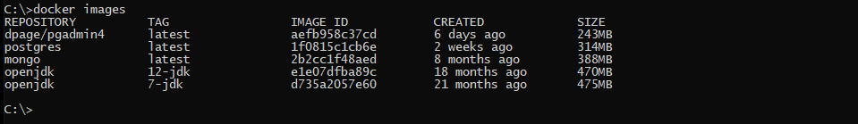
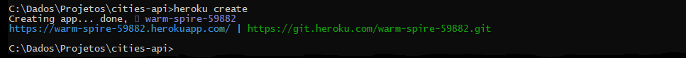
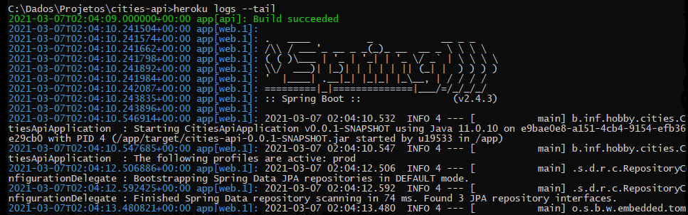
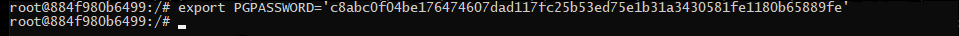

# Cities API
<p align="center">
  <a href="https://github.com/Janotte/dio-cities-api#about">About</a>&nbsp;&nbsp;&nbsp;|&nbsp;&nbsp;&nbsp;
  <a href="https://github.com/Janotte/dio-cities-api#requirements">Requirements</a>&nbsp;&nbsp;&nbsp;|&nbsp;&nbsp;&nbsp;
  <a href="https://github.com/Janotte/dio-cities-api#clone">Clone</a>&nbsp;&nbsp;&nbsp;|&nbsp;&nbsp;&nbsp;
  <a href="https://github.com/Janotte/dio-cities-api#database">Database</a>&nbsp;&nbsp;&nbsp;|&nbsp;&nbsp;&nbsp;
  <a href="https://github.com/Janotte/dio-cities-api#api">API</a>&nbsp;&nbsp;&nbsp;|&nbsp;&nbsp;&nbsp;
  <a href="https://github.com/Janotte/dio-cities-api#deploy">Deploy</a>
</p>


---

## About

In this project, a **API REST** with **Spring Boot** was developed, a small system to consult the countries and nations, states and cities of Brazil and calculate the distance between two Brazilian cities.

---

## Requirements

The following technologies were developed and used in this project.

- Microsoft Windows
- Java 11 or higher versions.
- Git
- Docker
- An IDE of your choice like IntelliJ Community, Eclipse Community or Spring Tool Suite 4.
- Postman

---

## Clone

```bash
# Clone project
$ git clone https://github.com/Janotte/dio-cities-api

#  Enter the project
$ cd dio-cities-api
```

---

## Database

 1. Follow these instructions to install Docker on Windows:

    ​	:whale: [Docker](https://docs.docker.com/docker-for-windows/install/)

    

 2. Getting required images, go to  the Windows command line prompt and execute:

    ```basic
    docker pull postgres
    docker pull dpage/pgadmin4
    ```

    

 3. Listing the existing images in your Docker:

    ```basic
    docker images
    ```
    
    
    
 4. Creating a network to execute the containers.

    ```basic
    docker network create --driver bridge postgres-network
    ```

    

 5. Creating folders for Docker volumes and copy scripts

    ```basic
    cd\
    mkdir data
    cd data
    copy C:\Dados\Projetos\dio-cities-api\data\*.sql
    ```

    

 6. Creating a container to run a PostgresSQL.

    ```basic
    docker run --name postgres-server --network=postgres-network -e "POSTGRES_PASSWORD=Your_Password" 
    -p 5432:5432 -v c:\postgresdb\data:/data -d -e "POSTGRES_DB=cities" postgres
    ```

    

    

 7. Listing the container instances.

    ```basic
    docker ps
    ```

    

 8. Geting inside the postgres docker container.

    ```basic
    docker exec -it postgres-server bash
    ```

    

 9. Populating the cities database.

    ```basic
    cd data
    psql -h 127.0.0.1 -d cities -U postgres -f country.sql
    psql -h 127.0.0.1 -d cities -U postgres -f state.sql
    psql -h 127.0.0.1 -d cities -U postgres -f city.sql
    psql -h 127.0.0.1 -d cities -U postgres -f extension.sql
    ```

    

    

    

    

 10. Listing all databases for postgres user.

     ```basic
     psql -U postgres -l
     ```

     

 11. Choosing the relevant db we want to use.

     ```basic
     psql -U postgres -d cities
     ```

     

 12. Geting all the tables of this database using command /d.

     ```basic
     \d
     ```

     

 13. Viewing the schema of a specific table.

     ```basic
     \d country
     ```

     

 14. Calculating the distance between two cities using the Point method.

     ```basic
     select ((select lat_lon from city where id = 4929) <@> (select lat_lon from city where id=5254)) as distance;
     ```

     

 15. Calculating the distance between two cities using the Cube method.

     ```basic
     select earth_distance(ll_to_earth(-21.95840072631836,-47.98820114135742), 
     ll_to_earth(-22.01740074157715,-47.88600158691406)) as distance;
     ```

     

 16. Quiting the SQL terminal.

     ```basic
     Ctrl + d
     exit
     ```

     

---

 ## API

To run the project on the terminal, enter the following command:

```

```

```
java -jar cities-api-0.0.1-SNAPSHOT.jar
```


To run the tests with Postman, import the cities collection.


---

## DEPLOY

In this section we will be exemplifying Deploy on Heroku.

1. Let's go to the project folder

   ```bash
   CD\
   C:\Dados\Projetos\dio-cities-api
   ```

   

2. Now we will log in to Heroku:

   ```
   C:\Dados\Projetos\dio-cities-api\heroku login
   ```

   

3. Created the Heroku project:

   ```bash
   C:\Dados\Projetos\dio-cities-api\heroku create
   ```

   

4. Verify origins in app:

   

5. Now we are going to send the project to Heroku, after finishing sending, the dependencies will be installed and then it will be deployed.

   ```bash
   git push heroku master
   ```

   

   

6. To check the deployment logs use the following command. To exit, use Ctrl C:

   ```bash
   heroku logs --tail
   ```

   

7. Let's access the project on Heroku and get the database information needed to populate the data.

   

   

   

8. To populate our project database on Heroku, we will access the postgres container in the docker.

   ```bash
   docker exec -it postgres-server bash
   ```

   

9. Exporting the database password

   ```bash
   export PGPASSWORD='c8abc0f04be176474607dad117fc25b53ed75e1b31a3430581fe1180b65889fe'
   ```

   

10. Use the following syntax to populate the Heroku database.

    ```bash
    psql -h <Host> -d <Database> -U <User> -f scritp.sql
    ```

    

11. Populating the country table

    ```bash
    psql -h ec2-54-163-140-104.compute-1.amazonaws.com -d dc5t4c80ls8vah -U suusvrdowrckjw -f country.sql
    ```

    

12. Populating the state table

    ```bach
    psql -h ec2-54-163-140-104.compute-1.amazonaws.com -d dc5t4c80ls8vah -U suusvrdowrckjw -f state.sql
    ```

    

13. Populating the city table

    ```bash
    psql -h ec2-54-163-140-104.compute-1.amazonaws.com -d dc5t4c80ls8vah -U suusvrdowrckjw -f city.sql
    ```

    

14. Creating the necessary extensions

    ```bash
    psql -h ec2-54-163-140-104.compute-1.amazonaws.com -d dc5t4c80ls8vah -U suusvrdowrckjw -f extension.sql
    ```

    

15. To test the application with Postman, change the host address.

    


---

<h3 align="center">
  Developed by Sandro André Janotte
  <br/>


  <a align="center">

   [ LinkedIn](https://www.linkedin.com/in/sandro-andr%C3%A9-janotte-2b022450/)
&nbsp;
  [ GitHub](https://github.com/janotte)
  </a>

